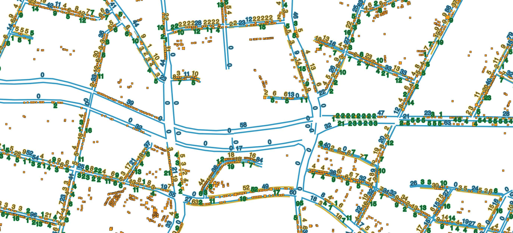

DIESE SEITE IST GERADE IM AUFBAU :construction:

# Öffentliche Vernetzungs- und Informationsseite zu Parkplatzdaten in Berlin :wave:

Diese Seite greift den Wunsch nach einer zentralen Informationsseite zum Thema Parkplatzdaten auf. Der Bedarf an einen (digitalen) Ort, um Informationen zu bündeln, sich auszutauschen und miteinander zu arbeiten wurde im Rahmen des öffentlichen [Vernetzungstreffen zu Parkplatzdaten am 22.1.2022 im CityLAB Berlin](https://odis-berlin.de/aktuelles/2022-12-01-parkplatztreffen/) deutlich. Mehrere ehrenamtliche Initiativen sowie Vertreter:innen der Verwaltung folgten der Einladung von Hans Hack (ODIS/CityLAB) und Prof. Dr. Sebastian Meier (FH Potsdam) zu einem ersten Austausch über Parkplatzdaten und Anwendungsfälle. 

Dabei ist klar geworden: **Vielerorts fehlt es an einer guten Datengrundlage und an systematischem Wissen zu Parkplatzdaten**. Gleichzeitig setzen sich immer mehr Akteure aus Zivilgesellschaft, Wissenschaft und Verwaltung mit dem Thema auseinander und versuchen die Lücke zu schließen.

Wir laden alle Interessierte ein, das Informationsangebot wachsen zu lassen und sich miteinander ausztauschen - Wir freuen uns über Projektvorstellungen, Veranstaltungstips, Fragen oder Projektideen!

*Screenshot von Berliner Parkplatzdaten in einem GIS Programm*

## Akteur:innen / Projekte :busts_in_silhouette:
An dieser Stelle sammeln wir die uns bekannten Akteur:innen und Projekte. Die Liste kann gerne ergänzt werden!

### Ehrenamtliche Initiativen

#### [Parkraumprojekt der OSM-Verkehrswendegruppe](https://parkraum.osm-verkehrswende.org/) - Mit der OpenStreetMap den Straßenraum kartieren
Die ehrenamtlich aktive OpenStreetMap-Community nutzt ein "Subtraktives Modell" als Datenerhebungsmethodik. Dabei werden verschiedene Elemente wie Parkstreifen, Einfahrten, Parkverbote oder Haltestellen auf Fahrbahnen getagged. Darauf aufbauend wird ein Parkraummodell erstellt und die Daten visualisiert. [Am Beispiel des Bezirks Neukölln](https://parkraum.osm-verkehrswende.org/project-prototype-neukoelln/?map=parkingmap) konnte die OSM-Community 40.000 Stellplätze ermitteln.  **Die Daten stehen offen zur Verfügung und sind unter anderem als GeoJSON exportierbar**. 

Ansprechperson: [Alex Seidel](mailto:alex@osm-berlin.org)

#### [Parkplatz Transform](https://www.xtransform.org) - Mit einer App zu mehr Flächengerechtigkeit
2019 gründetet sich die ehrenamtliche, parteiübergreifende Initiative Parkplatz Transform. Aufgrund fehlender Parkplatzdaten hat man mit Freiwilligen und lokalen Initiativen auf der Straße Kartierungen organisiert und mithilfe einer App dokumentiert. So konnte eine umfassende Datenbank erstellt werden. Innerhalb des S-Bahnrings wurde so eine Gesamtzahl von 229.249 Kfz-Parkplätzen ermittelt! Parkplatz Transform stellt die **offenen Daten und das Kartierungstool auf ihrer [Webseite](https://www.xtransform.org)bereit**.

#### [Project Car Tagger](https://github.com/hanshack/car-tagging-data-berlin/) - Mit Luftbilder Fahrzeuge taggen
Das von Hans Hack selbst programmierte Tool Car Tagger kann fahrende oder parkende Autos anhand ihres Umrisses mit Satellitenbildern ausfindig machen und markieren. Gemeinsam mit Freiwilligen konnte so mittlerweile 50% der Fläche Berlins und ca. 500.000 Autos getagged werden.**Die Daten stehen als offene Daten zur Verfügung**. 

Ansprechperson: [Hans Hack](hanshack@troet.cafe)

#### [Paper planes](https://www.paper-planes.net) - Mit Parkplatzdaten den Straßenraum neu gestalten
Der Verein paper planes e.V entwickelt Konzepte und Ideen für die Stadt der Zukunft. Dabei kommt dem öffentlichen Straßenraum eine besondere Rolle zuteil, da er die Chance bietet, das Zusammenleben in der Stadt ganz neu zu gestalten. Für paper planes ist eine umfassende Datenlage zu Parkplätzen eine wichtige Grundlage für weitere Aktivitäten.

Ansprechperson: [Simon Wöhr](mailto:)

### Forschungsprojekte 

#### [Pasymo](https://www.fh-potsdam.de/studium-weiterbildung/projekte/pasymo) – Mit Daten und Tools Partizipation ermöglichen
Das Forschungsprojekt Pasymo ist am Institut für angewandte Forschung (IaF) Urbane Zukunft der FH Potsdam angesiedelt mit dem Ziel gemeinsam mit städtischen Akteuren und Bürgerschaft eine Toolbox bestehend aus Modellen, Computersimulationen und Workshop-Konzepten zu entwickeln. Die Forschungsgruppe kann dabei auf ein Lastenrad zurückgreifen, um mit dem Modell zu Bürger:innen und politischen Entscheidungsträger:innen vor Ort zu gelangen. Parkplatzdaten würden auch hier eine gute Grundlage für evidenzbasierte Politik und Stadtplanung bilden.

### Berliner Verwaltung

#### Senatsverwaltung für Umwelt, Mobilität, Verbraucher- und Klimaschutz (SenUMVK) - Erste großflächige Datenerhebung gestartet
Mit einer Parkraumkartierung und Parkdatenanalyse durch einen externen Dienstleister will die Senatsverwaltung für Umwelt, Mobilität, Verbraucher- und Klimaschutz (SenUMVK) Parkplatzdaten sammeln. Dafür soll eine Kartierung von öffentlichen Parkplätzen innerhalb des S-Bahn Rings und angrenzender Gebiete erfolgen, sowie eine Erfassung von Auslastung, Parkverhalten und Parksuchverkehr vor und nach Einführung von neuen Parkzonen. Gerade mit den dynamischen Daten zum Beispiel zum Parksuchverkehr soll so die Grundlage geschaffen werden, verkehrspolitische Maßnahmen wie zum Beispiel die Einführung von Parkzonen zu bewerten. Aber auch für angrenzende Themen wie die Messung der Luftqualität sollen die Daten herangezogen werden. **Die vorläufigen Kartierungsdaten stehen der Community ab Mai 2023 zur Verfügung. Interessierte können sich an sich an [Benjamin Sternkopf](mailto:Benjamin.Sternkopf@SenUMVK.berlin.de) wenden. Eine Veröffentlichung im Geoportal und auf der Digitalen Plattform Stadtverkehr soll im Juli 2023 erfoim Herbst 2023 veröffentlicht werden**. 

Ansprechperson: [Benjamin Sternkopf](mailto:Benjamin.Sternkopf@SenUMVK.berlin.de)

#### [Bezirk Charlottenburg-Wilmersdorf](https://www.berlin.de/ba-charlottenburg-wilmersdorf/service/formulare/artikel.194652.php)
Als erster Berliner Bezirk hat Charlottenburg-Wilmersdorf Daten zum Parkraumbestand ermitteln lassen. Die Daten liegen frei verfügbar als offene Daten auf dem Open Data Portal Berlin bereit.

#### Bezirk Friedrichshain-Kreuzberg: 

Auch der Bezirk Friedrichshain-Kreuzberg hat großes Interesse an Parkplatzdaten, um die Planung und Bewirtschaftung des Straßenraums datengestützt voranzutreiben. Seit 2022 arbeitet der Bezirk mit der OSM-Community und FixMyCity zusammen, um in einer gemeinsamen Kampagne zusammen mit zivilgesellschaftlichen Akteuren Parkraumdaten für den Bezirk zu erfassen.

Die Daten können hier angeschaut werden: [geodaten-fk](https://www.geodaten-fk.de/) 

Ansprechperson: [Simon Stolz](mailto:)

## Anwendungen :car:
- Die Daten von Parkplatztransform können auf einer interaktiven Karte des Tagesspiegels [hier angesehen werden](https://interaktiv.tagesspiegel.de/lab/wie-viele-autos-gibt-es-in-meiner-nachbarschaft-diese-berliner-kieze-bestehen-am-meisten-aus-parkplaetzen/) *Stand: 31.10.22*
- Eine spannende Visualisierung der Daten hat Hans in [dieser Anwendung](https://hanshack.com/howmanycars/?viewRatio=false&zoom=13.084933259369187&lng=13.443490099742121&lat=52.47016553456325) vorgenommen, die das Verhältnis von parkenden und fahrenden Autos in Berlin zeigt.

## (Offene) Daten :bar_chart:

### Open Data Portal Berlin
- [Parkraumbestand in Teilen Charlottenburg-Wilmersdorfs](https://daten.berlin.de/datensaetze/parkraumbestand-teilen-charlottenburg-wilmersdorfs)

### FIS-Broker
- [Behindertenparkplätze](https://fbinter.stadt-berlin.de/fb/index.jsp?loginkey=zoomStart&mapId=k_bparkplatz@senstadt&bbox=360180,5798703,425782,5838830) - **Lizenz: [DL-DE->BY-2.0](https://www.govdata.de/dl-de/by-2-0)**

- [Straßenbefahrung 2014](https://fbinter.stadt-berlin.de/fb/index.jsp?loginkey=zoomStart&mapId=k_StraDa@senstadt&bbox=385430,5816847,385638,5816973) - **Lizenz: [DL-DE->BY-2.0](https://www.govdata.de/dl-de/by-2-0)**

### Weitere Quellen
- [Kartierte Parkplätze durch Parkplatz Transform](https://www.xtransform.org)
- [OpenStreetMap-Daten](https://parkraum.osm-verkehrswende.org/project-vector-tiles) - **Lizenz: [ODbL 1.0](https://wiki.osmfoundation.org/wiki/Licence)**
- [Parkverstöße in Berlin basierend auf Bildbefahrungsdaten (2019)](https://data.fid-move.de/dataset/parkverstobe-in-berlin-basierend-auf-bildbefahrungsdaten-2019)
- [Verschieden Parkplatzdaten für Friedrichshain-Kreuzberg](https://www.geodaten-fk.de/MeinXhain/Portal/) *Unter: Fachdaten > Mobilität > Parken*
- [Car Tagger](https://github.com/hanshack/car-tagging-data-berlin) - **Lizenz: [ODbL 1.0](https://wiki.osmfoundation.org/wiki/Licence)**
## Veranstaltungen :date:
* **22.11.2022** [Parkplatzdaten - Erfassung und Nutzung. Vernetzungstreffen im CityLAB Berlin](https://citylab-berlin.org/de/events/parkplatzdaten-erfassung-und-nutzung/)
* **20.04.2023** [Parkplatzdaten - Erfassung und Nutzung. Vernetzungstreffen 2 im CityLAB Berlin](https://odis-berlin.de/aktuelles/2023-04-21-2.parkplatztreffen/)

## Medienberichte :newspaper:
- [Die große Parkplatzsuche](https://taz.de/Recht-auf-Stadt/!5902129/) *taz vom 20.12.2022*
- [Diese Berliner Kieze bestehen am meisten aus Parkplätzen](https://interaktiv.tagesspiegel.de/lab/wie-viele-autos-gibt-es-in-meiner-nachbarschaft-diese-berliner-kieze-bestehen-am-meisten-aus-parkplaetzen/) *Tagesspiegel vom 02.11.2022*
- [Grüne und Linke wollen weniger Parkplätze in Berlin: „Es wird wehtun“](https://www.berliner-zeitung.de/mensch-metropole/gruene-und-linke-wollen-weniger-parkplaetze-in-berlin-es-wird-wehtun-li.282453) *Berliner Zeitung vom 01.11.2022*
- [Parkplätze werden in Berlin jetzt per Scan erfasst](https://www.rbb24.de/panorama/beitrag/2022/04/berlin-parkplaetze-scan-parken-erfassung-auslastung-saubere-luft.html) *RBB vom 19.04.2022*

## Schemas 🗄️

- [ParkingFacility von schema.org](https://schema.org/ParkingFacility)
- [Kartieren von Parkplätzen im Straßenraum bei OpenStreetMap](https://wiki.openstreetmap.org/wiki/DE:Street_parking)

## Kontaktmöglichkeiten :mailbox_with_mail:
Bei Fragen und Anregungen schreibt uns gerne per [Mail](mailto:odis@ts.berlin) oder hinterlasst hier Issues!

Mehr Informationen zur [Open Data Informationsstelle Berlin](https://odis-berlin.de)

Mehr Informationen zum [CityLAB Berlin](https://citylab-berlin.org/de/start/)

## Credits

<table>
  <tr>
    <td>
      <a href="https://odis-berlin.de">
         
         
        
      </a>
    </td>
    <td>
      Together with: <a href="https://citylab-berlin.org/en/start/">
         
         
        
      </a>
    </td>
    <td>
      A project by: <a href="https://www.technologiestiftung-berlin.de/en/">
         
         
        
      </a>
    </td>
    <td>
       Supported by: <a href="https://www.berlin.de/sen/inneres/">
         
         
         
      </a>
    </td>
  </tr>
</table>

